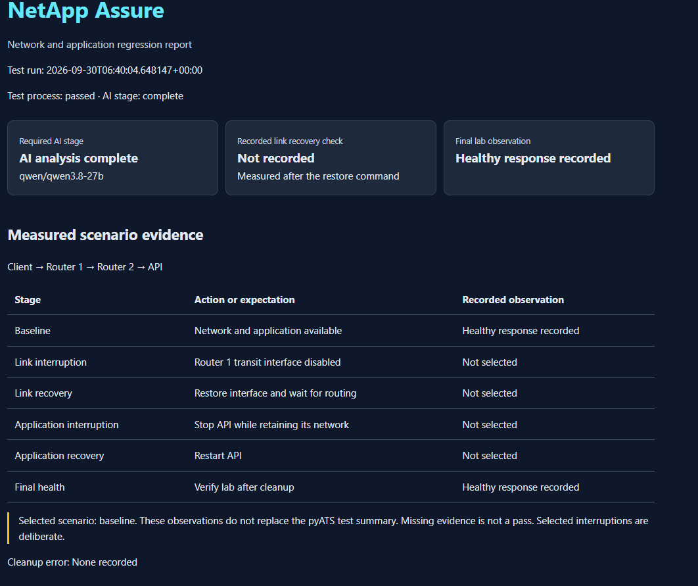
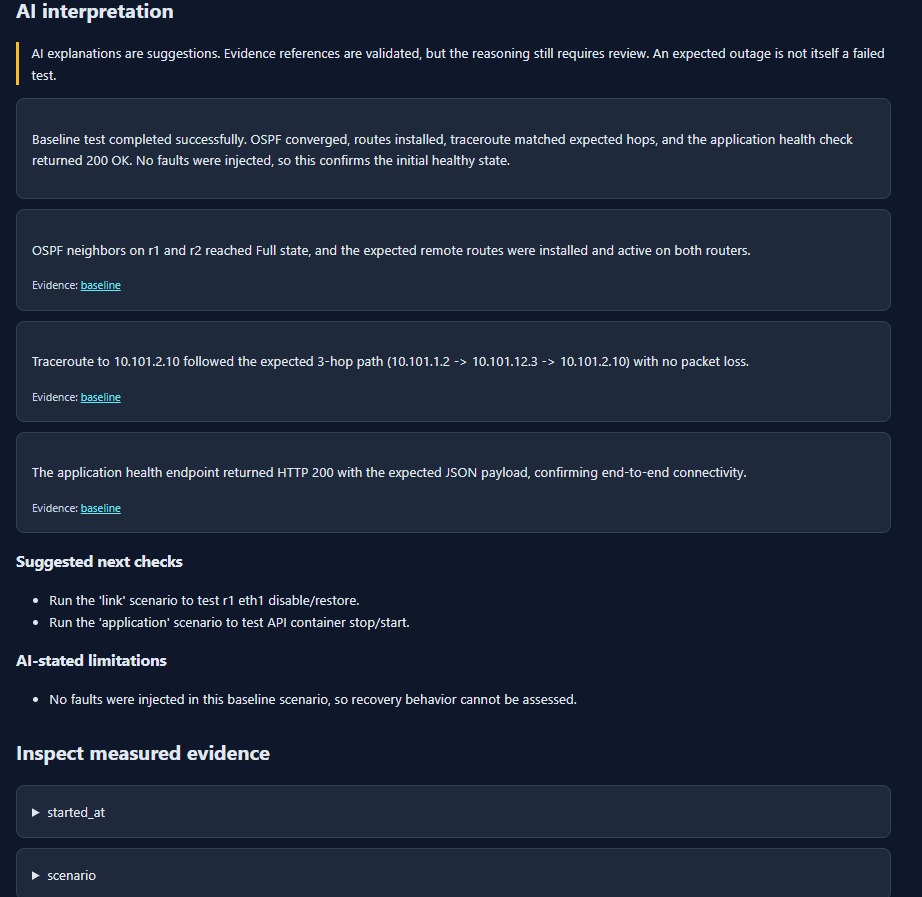
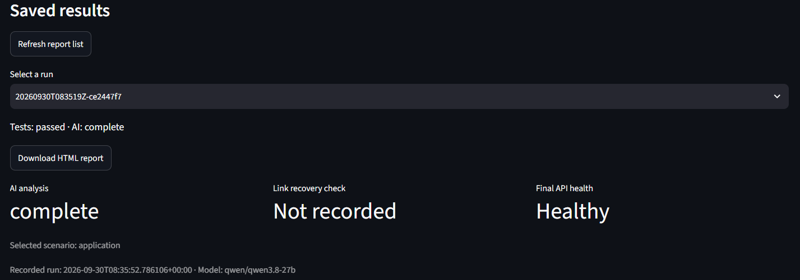
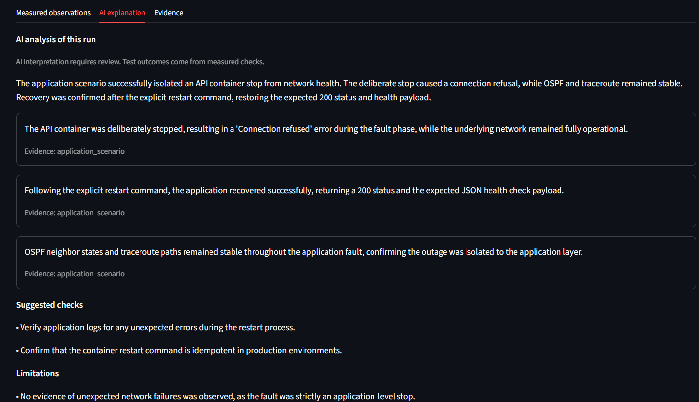

# NetApp Assure

An AI-assisted network and application regression testing project, built independently of TestForge.

## Current milestone

A small read-only FastAPI inventory service, API contract tests, and Docker packaging. The inventory is sample data, not discovered devices. `/health` measures application liveness only.

A separate FRR lab, baseline verification script, and pyATS link interruption and application-stop scenarios are included. Groq analysis and an HTML report are implemented; live provider validation requires your API key in the invoking terminal. AI analysis is required to complete the workflow. A failed AI call leaves the report explicitly incomplete while preserving measured test results. AI explains evidence, not test outcomes.

## Screenshots

These screenshots show the local Docker lab dashboard and successful baseline and
application runs. They do not demonstrate a completed `all` run or physical device compatibility.

### Dashboard controls

Choose a scenario and check container readiness. A credential marked "Set" only
indicates that a key is present; the AI request verifies provider access.


### Baseline report

Baseline tests and AI analysis completed successfully. Fault scenarios were not
selected, so no link recovery measurement is expected.



### Baseline AI interpretation

AI explanations need review: the screenshot's "no packet loss" statement exceeds
what this traceroute check establishes. The check confirms the observed hop path,
not a packet-loss measurement.



### Application scenario results

The application run passed, AI analysis completed, and final API health was healthy.
"Link recovery: Not recorded" is expected for this application-only run.



### Application AI explanation

The saved evidence records API unavailability during the intentional stop, healthy
network checks during that fault, and API recovery after restart. These are sampled
checks, not continuous monitoring of every moment during the outage.



## Running the dashboard

To keep the dashboard running while using your Ubuntu terminal, activate the
virtual environment and launch it in the background:

```bash
source ../.venv-wsl/bin/activate
python scripts/start_dashboard.py
```

Use the terminal where `GROQ_API_KEY` is exported. The launcher inherits the key
without saving it to disk. If the foreground Streamlit command is already running,
press Ctrl+C in that terminal before using this launcher. Open http://127.0.0.1:8501.
The launcher returns your prompt and prints a PID and stop command. Server logs
are saved in `reports/dashboard-server.log`. This is not automatic startup:
run the launcher again after Windows restarts or WSL shuts down.

In Ubuntu, from this project directory, use the terminal where the replacement `GROQ_API_KEY` is exported:

```bash
source ../.venv-wsl/bin/activate
python -m pip install -r requirements-ui.txt
python -m streamlit run dashboard.py --server.address 127.0.0.1 --server.port 8501
```

Open http://localhost:8501. Keep Docker and the lab running. Choose a scenario; the Run button launches its checks and required AI analysis as a background process. A live log refreshes every three seconds. Refresh the report list when it finishes, then view or download the result. Earlier standalone reports can also be viewed.

The dashboard reads the key from its server environment; it never puts it in the page or process command line. Start it from the terminal holding the key. Browser refresh does not launch a new run. The cached job manager prevents double-click launches, and the pipeline's Linux lock prevents overlapping fault runs across dashboard and CLI. Do not invoke the standalone network suite concurrently. Closing the browser does not stop a run. The dashboard does not start or stop the Docker lab automatically and is intended for localhost only.

## Command-line pipeline

With the Docker lab already running and `GROQ_API_KEY` set in your Ubuntu terminal:

```bash
source ../.venv-wsl/bin/activate
python scripts/run_project.py
```

This runs both pyATS fault scenarios, then required AI analysis against only the new run's evidence. Reports are stored separately under `reports/runs/<run-id>/`; open the `report.html` there. `pipeline-status.json` records test and AI process outcomes. Failed tests still receive AI analysis when fresh finished evidence exists; an AI explanation cannot turn failing tests into success. Missing keys stop execution before fault injection. This command does not start Docker or the lab for you.

Runs through this command are serialized with a Linux file lock. Do not separately run the fault suite while a pipeline is active. Forced termination may interrupt cleanup; use the restoration commands below and verify baseline health. Individual subprocess operations have timeouts, but the orchestrator does not forcibly kill the suite during its cleanup.

If AI fails, retry only the analysis for that run (replace the example directory):

```bash
NETAPP_REPORT_DIR="$PWD/reports/runs/<run-id>" python scripts/ai_report.py
```

The retry updates that run's AI report; `pipeline-status.json` still describes the original pipeline attempt.

## Analyse existing standalone evidence

After running the suite, use the same Ubuntu terminal where you set your replacement `GROQ_API_KEY`:

```bash
source ../.venv-wsl/bin/activate
python scripts/ai_report.py
```

This sends selected evidence from `reports/network-evidence.json` to Groq's chat completion API. It does not send repository files or environment variables as evidence. The key is read from the environment and used only for authentication. Default model: `qwen/qwen3.8-27b`, selected from the model list returned for this setup. Override with `GROQ_MODEL` if your account requires another JSON-capable model. Model listing alone does not verify inference permissions; the live analysis call is still required. Run `python scripts/list_ai_models.py` to inspect the current list.

Open `reports/report.html` in your Windows browser. The separate `reports/ai-report.json` records the source evidence hash, model, explanation, and completion status. The original evidence remains unchanged. On provider errors or invalid evidence references, the command exits unsuccessfully and writes an incomplete report. Retry the command after fixing the issue; you need not repeat fault injection. Reference validation checks that cited fields exist, not that the model's reasoning is correct. Review explanations against measured evidence.

AI integration tests use simulated provider responses, not real model calls. The HTML report separates recorded scenario observations from AI explanations, links findings to expandable evidence, and shows recovery timing. Missing evidence is displayed as unverified, not passing. Full workflow completion is distinct from passing all tests; the original pyATS console remains the authoritative test summary.

To refresh the HTML from saved analysis without calling Groq:

```bash
python scripts/report_view.py
```

The saved AI analysis is preserved exactly. Prompt improvements affect only future calls to `ai_report.py`; refreshing the HTML does not silently replace or correct earlier model output.

## Run in Ubuntu

From the parent workspace, activate the existing Linux environment and enter this project:

```bash
source .venv-wsl/bin/activate
cd netapp-assure
python -m pip install -r requirements-dev.txt
python -m pytest -q
python -m uvicorn app.main:app --host 127.0.0.1 --port 8000
```

Open http://localhost:8000/docs for interactive API documentation. Stop the local server with Ctrl+C before using Docker on the same port.

## Run in Docker

```bash
docker compose up --build -d --wait
curl --fail http://localhost:8000/health
curl --fail http://localhost:8000/devices
python scripts/smoke_api.py
docker compose down
```

Docker publishes the API only on localhost. This first milestone uses a direct connection; it does not yet prove a routed path through FRR.

## API contract

| Endpoint | Expected behaviour |
| --- | --- |
| GET /health | 200, `{"status":"ok"}` |
| GET /devices | 200, two sample FRR router records |
| GET /devices/1 | 200, matching inventory record |
| GET /devices/999 | 404, device not found |
| GET /devices/abc or /devices/0 | 422, invalid identifier |
| POST /devices | 405, read-only API |

## Routed lab

Run from this project directory in Ubuntu, with Docker Desktop running:

```bash
docker compose -f compose.lab.yaml up --build -d --wait
python scripts/check_lab.py
```

```text
client             r1                    r2                 API
10.101.1.10 --- 10.101.1.2            10.101.2.2 --- 10.101.2.10:8000
                   10.101.12.2 ------ 10.101.12.3
                            OSPF area 0
```

Three separate Docker bridge networks represent the client LAN, transit link, and server LAN, with IP masquerading disabled. Endpoints use the FRR routers as default gateways; routers explicitly remove Docker's default routes. OSPF advertises the remote LANs, using explicit unicast neighbours on a non-broadcast transit network. Docker's `internal` bridge option is intentionally not used: its subnet filtering blocked routed traffic during validation. These bridges are a local test topology, not a security boundary against the Docker host.

The API shares the `api-net` container's network namespace so routing can be configured without granting networking capabilities to the application itself. Docker exec provides management access independently of the tested network.

The lab has no published API port: use the client to reach the API. The earlier localhost demo is a separate Compose project and is not used for routed tests. The lab script waits for convergence, checks Full neighbours and installed OSPF routes in both directions, verifies traceroute hops, checks API health, and saves evidence to `reports/lab-baseline.json`. This is a baseline check, not a completed AI report.

Useful commands:

```bash
docker compose -f compose.lab.yaml exec r1 vtysh -c 'show ip ospf neighbor'
docker compose -f compose.lab.yaml exec client curl --fail http://10.101.2.10:8000/devices
docker compose -f compose.lab.yaml down
```

The containers' combined memory limits total 832 MiB; Docker/WSL overhead is additional. Address ranges must not overlap other Docker networks. The lab uses FRR 10.5.2 from the [official FRR registry](https://frrouting.org/release/10.5.2/) and Compose [interface naming](https://docs.docker.com/reference/compose-file/services/#interface_name) to keep router configuration stable. Router containers have elevated capabilities for FRR operation; use this isolated local lab for experiments.

## pyATS network and application failure scenarios

With the lab running and the Ubuntu virtual environment active:

```bash
python -m pip install -r requirements-network.txt
python scripts/network_suite.py
```

The first scenario changes only `r1`'s `eth1` in the dedicated Compose lab. It requires a healthy baseline, verifies the interface goes down, checks that the API becomes unreachable, restores the interface in a `finally` block, and verifies routing and API recovery.

The second scenario establishes a fresh healthy baseline, stops only the lab API container, verifies its stopped state, confirms that OSPF, routes, and the network path still work, and verifies HTTP unavailability. The separate `api-net` container keeps the API host network alive. The scenario restarts the API in a `finally` block and verifies full recovery. Thus the evidence distinguishes a broken routed path from a stopped application on a healthy path.

Common cleanup retries restoration when necessary, attempting both resources even if one fails. Forced process termination or a Docker failure can prevent cleanup; restore manually with these commands, then rerun the baseline:

```bash
docker compose -f compose.lab.yaml exec r1 ip link set eth1 up
docker compose -f compose.lab.yaml start api
python scripts/check_lab.py
```

Evidence is saved in `reports/network-evidence.json`, including any cleanup error (the combined command instead uses its own run directory). The recovery check has a 90-second target (individual subprocesses have their own bounded timeouts). Raw test evidence keeps `workflow_complete` false because the separate required AI stage has not yet run at evidence collection time. Run only one fault test at a time against this shared lab. The structure follows [pyATS setup/test/cleanup conventions](https://devnet-pubhub-site.s3.amazonaws.com/media/pyats/docs/aetest/structure.html).

## Planned workflow

YAML configuration → baseline network and API checks → controlled lab fault → verify disruption → restore original state → verify recovery → collect evidence → required AI analysis → HTML report.

## GitHub checks

The `.github/workflows/ci.yml` workflow runs on pushes and pull requests. It installs Python 3.12 dependencies, runs API and simulated AI/pipeline tests, validates both Compose files, and builds and tests the standalone API container. It requires no Groq key. It does not run the FRR fault suite or live AI analysis; those remain local integration checks.

Publish the contents of **netapp-assure** as the repository root so GitHub discovers the workflow. This folder has not yet been published by this setup. The workflow uses the official [checkout](https://github.com/actions/checkout) and [setup-python](https://github.com/actions/setup-python) actions. A successful local test run does not prove that GitHub CI has executed; check the Actions tab after pushing.

## Remaining work

- Verify the combined live pipeline from the Ubuntu terminal that holds the API key.
- Pin a reproducible dependency set and add more failure scenarios.
- Publish the repository and verify the GitHub Actions run.
- Physical Cisco compatibility requires separate adapters and validation on actual equipment.

## Selecting scenarios and test expectations

The dashboard scenario selector and the pipeline command support `all`, `baseline`,
`link`, and `application`. Every pipeline run includes required AI analysis.
Baseline introduces no faults; link and application runs exercise only their selected fault.

From Ubuntu with the virtual environment active:

```bash
python scripts/run_project.py --validate-config
python scripts/run_project.py --scenario baseline
python scripts/run_project.py --scenario link
python scripts/run_project.py --scenario application
python scripts/run_project.py --scenario all
```

Edit `config/lab.yaml` for expected OSPF peers/routes, HTTP path, status and JSON body,
traceroute hops, and request/recovery timeouts. Invalid settings stop the pipeline
before tests start. These are test expectations, not router configuration changes.
Fault targets remain the fixed local Docker lab. Physical device support is not implemented.
Use `--config config/lab.yaml` to select a configuration file from the CLI.
Each pipeline report directory saves `configuration.yaml` for reproducibility.
The dashboard uses `config/lab.yaml` and overrides its scenario with your selection.
